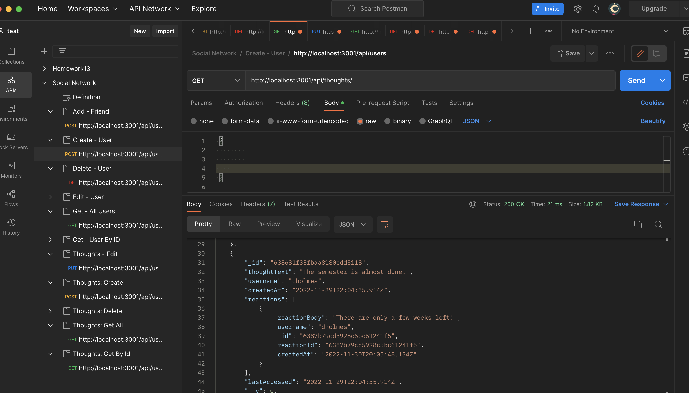

# social_network_api

## Table of Contents
- [Project description](#Description)
- [Usage](#Usage)
- [Installation](#Installation)
- [Contributions](#Contributions)

## Description
This assignment is to build an API for a social network web application where users can share their thoughts, react to friends’ thoughts, and create a friend list.

## Usage
Using the tutorial link below, you can watch the routes from the backend in Postman for creating, editing and deleting users and their thoughts as well as creating friendships and reactions. 

https://pacific-badlands-98451.herokuapp.com/ 

## Installation
express, node.js, nodemon & mongoose

## Contributions
UCF TA's and fellow classmates.